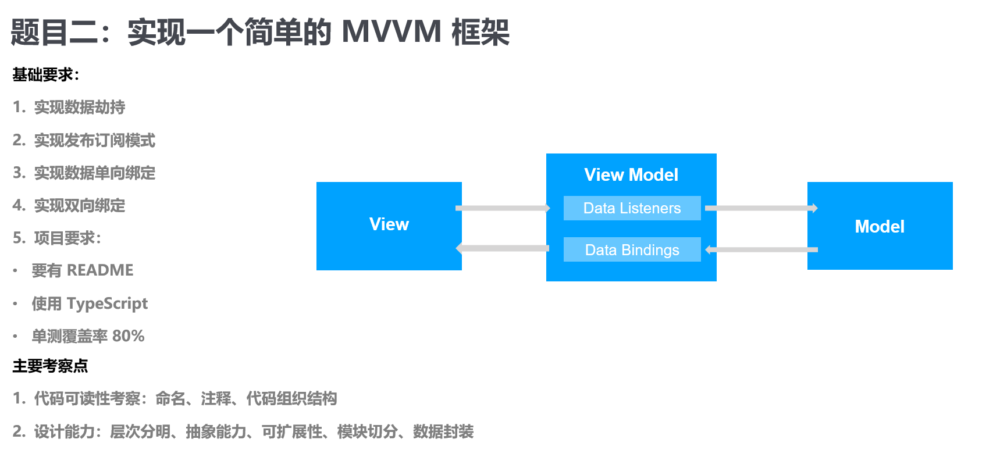
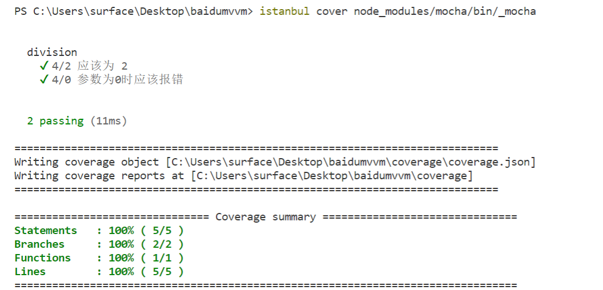

# 百度前端大作业

## 南京大学 刘子扬 软件工程 20级 2581871230

## 基于Vue的简易MVVM实现

### MVVM（Model-View-ViewModel)

- **ViewModel**：内部集成了**Binder**(Data-binding Engine，数据绑定引擎)，在MVP中派发器**View**或**Model**的更新都需要通过**Presenter**手动设置，而**Binder**则会实现**View**和**Model**的双向绑定，从而实现**View**或**Model**的自动更新。
- **View**：可组件化，例如目前各种流行的UI组件框架，**View**的变化会通过**Binder**自动更新相应的**Model**。
- **Model**：**Model**的变化会被**Binder**监听(仍然是通过观察者模式)，一旦监听到变化，**Binder**就会自动实现视图的更新。

可以发现，MVVM在MVP的基础上带来了大量的好处，例如：

- 提升了可维护性，解决了MVP大量的手动同步的问题，提供双向绑定机制。
- 简化了测试，同步逻辑是交由**Binder**处理，**View**跟着**Model**同时变更，所以只需要保证**Model**的正确性，**View**就正确。

当然也带来了一些额外的问题：

- 产生性能问题，对于简单的应用会造成额外的性能消耗。
- 对于复杂的应用，视图状态较多，视图状态的维护成本增加，**ViewModel**构建和维护成本高。

对前端开发而言MVVM是非常好的一种设计模式。在浏览器中，路由层可以将控制权交由适当的**ViewModel**，后者又可以更新并响应持续的View，并且通过一些小修改，MVVM模式可以很好的运行在服务器端，其中的原因就在于**Model**与**View**已经完全没有了依赖关系（通过View与Model的去耦合，可以允许短暂**View**与持续**View**的并存），这允许**View**经由给定的**ViewModel**进行渲染。

### 观察者模式和发布/订阅模式

#### 观察者模式

观察者模式是使用一个subject目标对象维持一系列依赖于它的observer观察者对象，将有关状态的任何变更自动通知给这一系列观察者对象。当subject目标对象需要告诉观察者发生了什么事情时，它会向观察者对象们广播一个通知。

一个或多个观察者对目标对象的状态感兴趣时，可以将自己依附在目标对象上以便注册感兴趣的目标对象的状态变化，目标对象的状态发生改变就会发送一个通知消息，调用每个观察者的更新方法。如果观察者对目标对象的状态不感兴趣，也可以将自己从中分离。

#### 发布/订阅模式

发布/订阅模式使用一个事件通道，这个通道介于订阅者和发布者之间，该设计模式允许代码定义应用程序的特定事件，这些事件可以传递自定义参数，自定义参数包含订阅者需要的信息，采用事件通道可以避免发布者和订阅者之间产生依赖关系。

#### 两者的区别

观察者模式：允许观察者实例对象(订阅者)执行适当的事件处理程序来注册和接收目标实例对象(发布者)发出的通知（即在观察者实例对象上注册update方法），使订阅者和发布者之间产生了依赖关系，且没有事件通道。不存在封装约束的单一对象，目标对象和观察者对象必须合作才能维持约束。 观察者对象向订阅它们的对象发布其感兴趣的事件。通信只能是单向的。

发布/订阅模式：单一目标通常有很多观察者，有时一个目标的观察者是另一个观察者的目标。通信可以实现双向。该模式存在不稳定性，发布者无法感知订阅者的状态。

### MVVM的实现演示

MVVM示例的使用如下所示，包括`browser.js`(View视图的更新)、`mediator.js`(中介者)、`binder.js`(MVVM的数据绑定引擎)、`view.js`(视图)、`hijack.js`(数据劫持)以及`mvvm.js`(MVVM实例)。

### MVVM的流程设计

#### 初始化流程

- 创建MVVM实例对象，初始化实例对象的`options`参数
- `proxyData`将MVVM实例对象的`data`数据代理到MVVM实例对象上
- `Hijack`类实现数据劫持功能（对MVVM实例跟视图对应的响应式数据进行监听，这里和Vue运行机制不同，干掉了`getter`依赖搜集功能）
- 解析视图指令，对MVVM实例与视图关联的DOM元素转化成文档碎片并进行绑定指令解析（`b-value`、`b-on-input`、`b-html`等，其实是Vue编译的超级简化版），
- 添加数据订阅和用户监听事件，将视图指令对应的数据挂载到**Binder**数据绑定引擎上（数据变化时通过Pub/Sub模式通知**Binder**绑定器更新视图）
- 使用Pub/Sub模式代替Vue中的Observer模式
- **Binder**采用了命令模式解析视图指令，调用`update`方法对View解析绑定指令后的文档碎片进行更新视图处理
- `Browser`采用了外观模式对浏览器进行了简单的兼容性处理

#### 响应式流程

- 监听用户输入事件，对用户的输入事件进行监听
- 调用MVVM实例对象的数据设置方法更新数据
- 数据劫持触发`setter`方法
- 通过发布机制发布数据变化
- 订阅器接收数据变更通知，更新数据对应的视图

### 中介者模式的实现

最简单的中介者模式只需要实现发布、订阅和取消订阅的功能。发布和订阅之间通过事件通道（channels）进行信息传递，可以避免观察者模式中产生依赖的情况。

在每一个MVVM实例中，都需要实例化一个中介者实例对象。

### 数据劫持的实现

#### 对象的属性

对象的属性可分为数据属性（特性包括`[[Value]]`、`[[Writable]]`、`[[Enumerable]]`、`[[Configurable]]`）和存储器/访问器属性（特性包括`[[ Get ]]`、`[[ Set ]]`、`[[Enumerable]]`、`[[Configurable]]`），对象的属性只能是数据属性或访问器属性的其中一种，这些属性的含义：

- `[[Configurable]]`: 表示能否通过 `delete` 删除属性从而重新定义属性，能否修改属性的特性，或者能否把属性修改为访问器属性。
- `[[Enumerable]]`:  对象属性的可枚举性。
- `[[Value]]`: 属性的值，读取属性值的时候，从这个位置读；写入属性值的时候，把新值保存在这个位置。这个特性的默认值为 `undefined`。
- `[[Writable]]`: 表示能否修改属性的值。
- `[[ Get ]]`: 在读取属性时调用的函数。默认值为 `undefined`。
- `[[ Set ]]`: 在写入属性时调用的函数。默认值为 `undefined`。

> 数据劫持就是使用了`[[ Get ]]`和`[[ Set ]]`的特性，在访问对象的属性和写入对象的属性时能够自动触发属性特性的调用函数，从而做到监听数据变化的目的。

对象的属性可以通过ES5的设置特性方法`Object.defineProperty(data, key, descriptor)`改变属性的特性，其中`descriptor`传入的就是以上所描述的特性集合。

### 数据双向绑定的实现

数据双向绑定主要包括数据的变化引起视图的变化（**Model** -> 监听数据变化 -> **View**）、视图的变化又改变数据（**View** -> 用户输入监听事件 -> **Model**），从而实现数据和视图之间的强联系。

在实现了数据监听的基础上，加上用户输入事件以及视图更新，就可以简单实现数据的双向绑定

### 简易视图指令的编译过程实现

在MVVM的实现演示中，可以发现使用了`b-value`、`b-text`、`b-on-input`、`b-html`等绑定属性（这些属性在该MVVM示例中自行定义的，并不是html标签原生的属性，类似于vue的`v-html`、`v-model`、`v-text`指令等），这些指令只是方便用户进行Model和View的同步绑定操作而创建的，需要MVVM实例对象去识别这些指令并重新渲染出最终需要的DOM元素

### ViewModel的实现

**ViewModel**(内部绑定器**Binder**)的作用不仅仅是实现了**Model**到**View**的自动同步（Sync Logic）逻辑（以上视图绑定指令的解析的实现只是实现了一个视图的绑定指令初始化，一旦**Model**变化，视图要更新的功能并没有实现），还实现了**View**到**Model**的自动同步逻辑，从而最终实现了数据的双向绑定。

因此只要在视图绑定指令的解析的基础上增加**Model**的数据监听功能（数据变化更新视图）和**View**视图的`input`事件监听功能（监听视图从而更新相应的**Model**数据，注意**Model**的变化又会因为数据监听从而更新和**Model**相关的视图）就可以实现**View**和**Model**的双向绑定。同时需要注意的是，数据变化更新视图的过程需要使用发布/订阅模式。

在**简易视图指令的编译过程实现**的基础上进行修改。

首先看下数据劫持，在**数据劫持的实现**的基础上，增加了中介者对象的发布数据变化功能（在抽象视图的**Binder**中会订阅这个数据变化）

## 单测覆盖率
